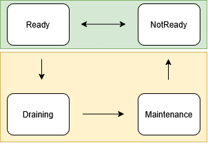
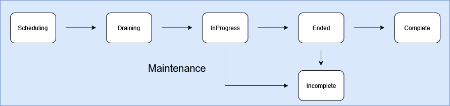
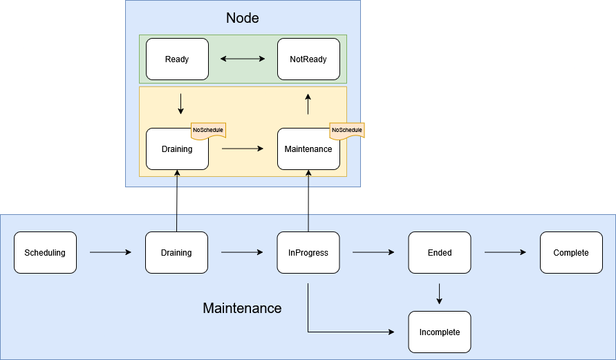

<!--
**Note:** When your KEP is complete, all of these comment blocks should be removed.

To get started with this template:

- [ ] **Pick a hosting SIG.**
  Make sure that the problem space is something the SIG is interested in taking
  up. KEPs should not be checked in without a sponsoring SIG.
- [ ] **Create an issue in kubernetes/enhancements**
  When filing an enhancement tracking issue, please make sure to complete all
  fields in that template. One of the fields asks for a link to the KEP. You
  can leave that blank until this KEP is filed, and then go back to the
  enhancement and add the link.
- [ ] **Make a copy of this template directory.**
  Copy this template into the owning SIG's directory and name it
  `NNNN-short-descriptive-title`, where `NNNN` is the issue number (with no
  leading-zero padding) assigned to your enhancement above.
- [ ] **Fill out as much of the kep.yaml file as you can.**
  At minimum, you should fill in the "Title", "Authors", "Owning-sig",
  "Status", and date-related fields.
- [ ] **Fill out this file as best you can.**
  At minimum, you should fill in the "Summary" and "Motivation" sections.
  These should be easy if you've preflighted the idea of the KEP with the
  appropriate SIG(s).
- [ ] **Create a PR for this KEP.**
  Assign it to people in the SIG who are sponsoring this process.
- [ ] **Merge early and iterate.**
  Avoid getting hung up on specific details and instead aim to get the goals of
  the KEP clarified and merged quickly. The best way to do this is to just
  start with the high-level sections and fill out details incrementally in
  subsequent PRs.

Just because a KEP is merged does not mean it is complete or approved. Any KEP
marked as `provisional` is a working document and subject to change. You can
denote sections that are under active debate as follows:

```
<<[UNRESOLVED optional short context or usernames ]>>
Stuff that is being argued.
<<[/UNRESOLVED]>>
```

When editing KEPS, aim for tightly-scoped, single-topic PRs to keep discussions
focused. If you disagree with what is already in a document, open a new PR
with suggested changes.

One KEP corresponds to one "feature" or "enhancement" for its whole lifecycle.
You do not need a new KEP to move from beta to GA, for example. If
new details emerge that belong in the KEP, edit the KEP. Once a feature has become
"implemented", major changes should get new KEPs.

The canonical place for the latest set of instructions (and the likely source
of this file) is [here](/keps/NNNN-kep-template/README.md).

**Note:** Any PRs to move a KEP to `implementable`, or significant changes once
it is marked `implementable`, must be approved by each of the KEP approvers.
If none of those approvers are still appropriate, then changes to that list
should be approved by the remaining approvers and/or the owning SIG (or
SIG Architecture for cross-cutting KEPs).
-->
# KEP-4212: Specialized Lifecycle Management

<!--
A table of contents is helpful for quickly jumping to sections of a KEP and for
highlighting any additional information provided beyond the standard KEP
template.

Ensure the TOC is wrapped with
  <code>&lt;!-- toc --&rt;&lt;!-- /toc --&rt;</code>
tags, and then generate with `hack/update-toc.sh`.
-->

<!-- toc -->
- [Release Signoff Checklist](#release-signoff-checklist)
- [Summary](#summary)
- [Motivation](#motivation)
    - [From General-Purpose to Specialized Lifecycle Management (SLM)](#from-general-purpose-to-specialized-lifecycle-management-slm)
    - [Accelerators and In-Place Upgrade](#accelerators-and-in-place-upgrade)
    - [Stateful Applications and Coordinated Drain](#stateful-applications-and-coordinated-drain)
    - [Capacity Management and Scheduling Drain](#capacity-management-and-scheduling-drain)
  - [Goals](#goals)
  - [Non-Goals](#non-goals)
- [Proposal](#proposal)
  - [User Stories (Optional)](#user-stories-optional)
    - [Story 1](#story-1)
    - [Story 2](#story-2)
    - [Story 3](#story-3)
    - [Story 4](#story-4)
    - [Story 5](#story-5)
    - [Story 6](#story-6)
    - [Story 7](#story-7)
    - [Story 8](#story-8)
  - [Notes/Constraints/Caveats (Optional)](#notesconstraintscaveats-optional)
  - [Risks and Mitigations](#risks-and-mitigations)
- [Design Details](#design-details)
  - [Test Plan](#test-plan)
      - [Prerequisite testing updates](#prerequisite-testing-updates)
      - [Unit tests](#unit-tests)
      - [Integration tests](#integration-tests)
      - [e2e tests](#e2e-tests)
  - [Graduation Criteria](#graduation-criteria)
  - [Upgrade / Downgrade Strategy](#upgrade--downgrade-strategy)
  - [Version Skew Strategy](#version-skew-strategy)
- [Production Readiness Review Questionnaire](#production-readiness-review-questionnaire)
  - [Feature Enablement and Rollback](#feature-enablement-and-rollback)
  - [Rollout, Upgrade and Rollback Planning](#rollout-upgrade-and-rollback-planning)
  - [Monitoring Requirements](#monitoring-requirements)
  - [Dependencies](#dependencies)
  - [Scalability](#scalability)
  - [Troubleshooting](#troubleshooting)
- [Implementation History](#implementation-history)
- [Drawbacks](#drawbacks)
- [Alternatives](#alternatives)
- [Infrastructure Needed (Optional)](#infrastructure-needed-optional)
<!-- /toc -->

## Release Signoff Checklist

<!--
**ACTION REQUIRED:** In order to merge code into a release, there must be an
issue in [kubernetes/enhancements] referencing this KEP and targeting a release
milestone **before the [Enhancement Freeze](https://git.k8s.io/sig-release/releases)
of the targeted release**.

For enhancements that make changes to code or processes/procedures in core
Kubernetes—i.e., [kubernetes/kubernetes], we require the following Release
Signoff checklist to be completed.

Check these off as they are completed for the Release Team to track. These
checklist items _must_ be updated for the enhancement to be released.
-->

Items marked with (R) are required *prior to targeting to a milestone / release*.

- [ ] (R) Enhancement issue in release milestone, which links to KEP dir in [kubernetes/enhancements] (not the initial KEP PR)
- [ ] (R) KEP approvers have approved the KEP status as `implementable`
- [ ] (R) Design details are appropriately documented
- [ ] (R) Test plan is in place, giving consideration to SIG Architecture and SIG Testing input (including test refactors)
  - [ ] e2e Tests for all Beta API Operations (endpoints)
  - [ ] (R) Ensure GA e2e tests meet requirements for [Conformance Tests](https://github.com/kubernetes/community/blob/master/contributors/devel/sig-architecture/conformance-tests.md) 
  - [ ] (R) Minimum Two Week Window for GA e2e tests to prove flake free
- [ ] (R) Graduation criteria is in place
  - [ ] (R) [all GA Endpoints](https://github.com/kubernetes/community/pull/1806) must be hit by [Conformance Tests](https://github.com/kubernetes/community/blob/master/contributors/devel/sig-architecture/conformance-tests.md) 
- [ ] (R) Production readiness review completed
- [ ] (R) Production readiness review approved
- [ ] "Implementation History" section is up-to-date for milestone
- [ ] User-facing documentation has been created in [kubernetes/website], for publication to [kubernetes.io]
- [ ] Supporting documentation—e.g., additional design documents, links to mailing list discussions/SIG meetings, relevant PRs/issues, release notes

<!--
**Note:** This checklist is iterative and should be reviewed and updated every time this enhancement is being considered for a milestone.
-->

[kubernetes.io]: https://kubernetes.io/
[kubernetes/enhancements]: https://git.k8s.io/enhancements
[kubernetes/kubernetes]: https://git.k8s.io/kubernetes
[kubernetes/website]: https://git.k8s.io/website

## Summary

The Kubernetes ecosystem has many Node Maintenance solutions, but some scenarios
remain partially solved or rely on fragmented solutions - most notably in-place upgrade.

This KEP proposes:
1. Adding new states to the Node API
1. Introducing a declarative Maintenance API to manage these states

Together, these changes will provide a standardized, extensible approach to
Node Maintenance, enabling support of a wide range of Specialized Lifecycle Management (SLM)
scenarios, especially those involving stateful workloads and specialized hardware.

## Motivation

Maintenance is not new to the Kubernetes community. Many core APIs and successful
projects already addressed application and cluster lifecycle needs.
What has changed is the environment in which Kubernetes operates: hardware accelerators
(e.g., GPUs, TPUs, etc.) have exploded in popularity in modern data centers.
These accelerators share certain operational requirements that are
common among stateful applications and have not been fully addressed by existing
lifecycle solutions. As a group, these scenarios can be referred to
as **Specialized Lifecycle Management** (SLM).

#### From General-Purpose to Specialized Lifecycle Management (SLM)

Until recently, general-purpose hardware dominated Kubernetes clusters. Maintenance
strategies such as **blue-green upgrades** - provisioning new hardware,
migrating workloads, and retiring the old node - were viable and effective.
In SLM scenarios, however, these approaches are often impractical because the
hardware and workloads have unique constraints:
- Accelerators are scarce, expensive, and have unique capabilities tied to their configuration, make, and model
- Stateful applications and ML workloads are sensitive to where they run and cannot simply migrate to idle hardware
- Capacity planning becomes more complex when multiple nodes and specialized devices are interdependent

These challenges require a different approach to Node Maintenance.

#### Accelerators and In-Place Upgrade

In SLM scenarios involving accelerators, the Node should be upgraded
**in place** - draining workloads, performing maintenance, and then restoring
service - rather than replacing the hardware outright.

Beneficiaries of in-place upgrade:
- **Admins** who want to allocate, configure, and test an accelerator only once
- **Users** can retain the exact hardware used during model training for reproducibility
- **Users** who want to avoid the cost of provisioning a new accelerator solely for an upgrade
- **Infrastructure Providers** who want to avoid maintaining an idle pool of accelerators just for maintenance

In-place Upgrade isn't the only solution for doing Node Maintenance in SLM scenarios.

#### Stateful Applications and Coordinated Drain

Stateful workloads such as, databases and ML jobs, bring their own complexities
to Node Maintenance. Unlike stateless apps, stateful applications often
maintain persistent connections, in-memory state, or data stored locally on nodes.
Coordinating drains or disruptions for these workloads requires careful planning
and orchestration to avoid impact to availability or data integrity.

Beneficiaries of coordinated drain:
- **Users** who want specialized control over application scale-in
- **Admins** who want to safely upgrade nodes running stateful apps without breaking availability guarantees

Not only is it important to control how to drain, it also important to know when
to drain.

#### Capacity Management and Scheduling Drain

Large Machine Learning jobs or other resource-intensive workloads often require
GPUs or other specialized devices spread across multiple nodes. Before draining nodes,
Admins need to consider the cluster’s capacity and maintenance schedule.

Beneficiaries of scheduling drain:
- **Users** who want their resource intensive jobs to complete, without being impacted by Node Maintenance
- **Admins** who want to maximize utilization while ensuring that maintenance proceeds
without compromising workload SLAs

### Goals

<!--
List the specific goals of the KEP. What is it trying to achieve? How will we
know that this has succeeded?
-->

This KEP seeks to enhance Kubernetes support for Node Maintenance in Specialized Lifecycle Management (SLM) scenarios
by introducing new Node states and a declarative API to manage them.
The proposed solution aims to empower Admins to reduce downtime, better lifecycle scarce
hardware resources, and ensure consistent, reliable maintenance across diverse environments.

- Add maintenance states to the Node API
- Introduce a Maintenance API

### Non-Goals

<!--
What is out of scope for this KEP? Listing non-goals helps to focus discussion
and make progress.
-->

- Provide an API that does eviction or drain
- Replace PodDisruptionBudgets

## Proposal

<!--
This is where we get down to the specifics of what the proposal actually is.
This should have enough detail that reviewers can understand exactly what
you're proposing, but should not include things like API designs or
implementation. What is the desired outcome and how do we measure success?.
The "Design Details" section below is for the real
nitty-gritty.
-->

### User Stories (Optional)

<!--
Detail the things that people will be able to do if this KEP is implemented.
Include as much detail as possible so that people can understand the "how" of
the system. The goal here is to make this feel real for users without getting
bogged down.
-->

#### Story 1

As a cluster admin I want to have a simple interface to initiate a node drain/maintenance without any required manual interventions.

#### Story 2

As a cluster admin, I want to be able to observe the node drain via the API and check on its progress. I also want to be able to discover workloads that are blocking the node drain.

#### Story 3

As a cluster admin, I want to be able to perform arbitrary actions after the node drain is complete, such as resetting GPU drivers, resetting NICs, performing software updates or shutting down the machine.

#### Story 4

As a cluster admin, I want to reduce the cost of doing maintenance on my hardware accelerators by using control-plane APIs to help coordinate maintenance and drain a Node.

#### Story 5

As an end user, I would like more alternatives to blue-green upgrades, especially with special hardware accelerators. I would like to choose a strategy on how to coordinate the node drain and the upgrade to achieve better cost-effectiveness.

#### Story 6

As a cloud provider, I need to perform regular maintenance on the hardware in my fleet. Enhancing Kubernetes to help cloud service providers safely remove hardware will reduce operational costs.

#### Story 7

As a user, I want to define when a Node can be considered Drained. This is so my application can finish all network and storage operations before terminating a pod. Including closing pod connections, removing pods from endpoints, unmounting volumes, writing cached writes to the underlying storage and completing storage cleanup routines.

#### Story 8

As an application owner, I want to run single replica applications without disruptions and have the ability to easily migrate the workload pods from one node to another. This also applies to applications with larger number of replicas that prefer to surge (upscale) pods first rather than downscale.

### Notes/Constraints/Caveats (Optional)

<!--
What are the caveats to the proposal?
What are some important details that didn't come across above?
Go in to as much detail as necessary here.
This might be a good place to talk about core concepts and how they relate.
-->

### Risks and Mitigations

<!--
What are the risks of this proposal, and how do we mitigate? Think broadly.
For example, consider both security and how this will impact the larger
Kubernetes ecosystem.

How will security be reviewed, and by whom?

How will UX be reviewed, and by whom?

Consider including folks who also work outside the SIG or subproject.
-->

#### Changing a Long-standing API

Introducing new states to a stable and critical Kubernetes API - the Node API -
needs to be well thought out and very stable. Since the proposal is to make
API additions, it's less scary than a modification or delete. However many
controllers reconcile the Node API so a clearly defined path for controllers
to understand new fields and will be paramount.

## Design Details

<!--
This section should contain enough information that the specifics of your
change are understandable. This may include API specs (though not always
required) or even code snippets. If there's any ambiguity about HOW your
proposal will be implemented, this is the place to discuss them.
-->

### Node States

Currently, Nodes have two states: `Ready` and `NotReady`. These states are
controlled by the Kubelet and indicate whether it can communicate with the API Server.
However, these states are too coarse for certain operational scenarios.
For example:
- A Node may be `Ready` but undergoing drain or a scheduled maintenance.
- A Node marked `NotReady` does not indicate maintenance status; it simply means the Kubelet cannot reach the API Server

To address this, this proposal adds two additional Node states:

*Draining*
- Indicates workloads and related Kubernetes objects (such as pods and volumes) are being removed from the Node
- Gives the Node a cordoned taint so that it does not accept new workloads (with exception for workloads with the proper toleration)

*Maintenance*
- Indicated workloads and related Kubernetes objects have been removed from the Node.
- The Node still has a cordoned taint



The new Node states provide a native Kubernetes API to track critical maintenance
states that today, is often put into Labels, Annotations, or CRDs.  Having these
new Node states provides granular states that controllers, operators, and workflows
can use for tracking maintenance.

#### In-place Node Maintenance

Now, with the new Node states, operators doing in-place Node Maintenance will use these
states as hooks to start drain and do maintenance.

*Draining*
- Start gracefully terminating workloads and cleaning up associated Kubernetes objects

*Maintenance*
- Begin performing maintenance tasks on the Node

These hooks make it easier to manage the transition from draining a Node to
actively maintaining it. However, drain is still challenging today in Kubernetes
and these new states will help improve it.

#### Coordinated and Declarative Drain

Draining is often application-specific, making it difficult for Kubernetes to
determine when an application is drained and how it should be drained.

Using the new Node states provides standardized hooks for workflows to:

*Draining*
- Migrate or gracefully shut down stateful applications before removal

*Maintenance*
- Indicate to Kubernetes and other operators that the Node is fully drained

With these explicit states, it provides a standardized way for Kubernetes to support:
- A Declarative Drain API
- Application specific drain workflows

To fully enable coordinated drains, there also needs to be an API to control
these new Node states and determine when to schedule a drain.

### Maintenance API

An API abstraction for managing the new Node states is important because:
- Changing a Node object is a highly privileged operation
- Users need a safe, trackable way to plan maintenance
- Node Maintenance is not the only type of maintenance

Users will create and update the Maintenance object to manage the lifecycle
of a maintenance.



```golang
// Maintenance defines a maintenance request
type Maintenance struct {
	metav1.TypeMeta `json:",inline"`

	// Standard Object metadata.
	// +optional
	metav1.ObjectMeta `json:"metadata,omitempty" protobuf:"bytes,1,opt,name=metadata"`

	// +required
	Spec MaintenanceSpec `json:"spec" protobuf:"bytes,2,opt,name=spec"`

	// Status represents the most recently observed status of a maintenance.
	// +optional
	Status MaintenanceStatus `json:"status,omitempty" protobuf:"bytes,3,opt,name=status"`
}

// MaintenanceSpec contains the details describing the Maintenance.
type MaintenanceSpec struct {
	// Node references a Node name that is subject to maintenance.
	// +required
	Node string `json:"node" protobuf:"bytes,1,opt,name=node"`

	// Client references a Maintenance Client that will reconcile this maintenance.
	// There may be many Maintenance Controllers so this field will signal which controller
	// should be assigned the work.
	// +optional
	Client string `json:"node" protobuf:"bytes,1,opt,name=node"`
}

// MaintenanceStatus contains the last observed status of a Maintenance.
type MaintenanceStatus struct {
	// +optional
	// +patchMergeKey=type
	// +patchStrategy=merge
	// +listType=map
	// +listMapKey=type
	Conditions []metav1.Condition `json:"conditions,omitempty" patchStrategy:"merge" patchMergeKey:"type" protobuf:"bytes,8,rep,name=conditions"`

	// Message is a human readable message.
	// +required
	// +kubebuilder:validation:Required
	// +kubebuilder:validation:MaxLength=32768
	Message string `json:"message" protobuf:"bytes,7,opt,name=message"`

	// MaintenancePhase tracks the current state of a maintenance.
	// Maintenance Controllers will be responsible for reconciling this state.
	// +optional
	MaintenancePhase *MaintenancePhase `json:"maintenancePhase,omitempty" protobuf:"bytes,1,opt,name=phase"`
}

type MaintenancePhase string

const (
	Scheduling MaintenancePhase = "Scheduling"
	Draining   MaintenancePhase = "Draining"
	InProgress MaintenancePhase = "InProgress"
	Ended      MaintenancePhase = "Ended"
	Incomplete MaintenancePhase = "Incomplete"
	Complete   MaintenancePhase = "Complete"
)

```
### Maintenance Controller

- Enforce valid state transitions
- Patch the Node object with state changes

### Maintenance Clients

- User created controller that will transition the Maintenance Phase on a Maintenance object.

#### Using Maintenance State to Schedule Drain and Manage Capacity

- A maintenance client will function as a scheduler, deciding which Node to drain and when

#### Maintenance Client Controlling Node States



### Test Plan

<!--
**Note:** *Not required until targeted at a release.*
The goal is to ensure that we don't accept enhancements with inadequate testing.

All code is expected to have adequate tests (eventually with coverage
expectations). Please adhere to the [Kubernetes testing guidelines][testing-guidelines]
when drafting this test plan.

[testing-guidelines]: https://git.k8s.io/community/contributors/devel/sig-testing/testing.md
-->

[ ] I/we understand the owners of the involved components may require updates to
existing tests to make this code solid enough prior to committing the changes necessary
to implement this enhancement.

##### Prerequisite testing updates

<!--
Based on reviewers feedback describe what additional tests need to be added prior
implementing this enhancement to ensure the enhancements have also solid foundations.
-->

##### Unit tests

<!--
In principle every added code should have complete unit test coverage, so providing
the exact set of tests will not bring additional value.
However, if complete unit test coverage is not possible, explain the reason of it
together with explanation why this is acceptable.
-->

<!--
Additionally, for Alpha try to enumerate the core package you will be touching
to implement this enhancement and provide the current unit coverage for those
in the form of:
- <package>: <date> - <current test coverage>
The data can be easily read from:
https://testgrid.k8s.io/sig-testing-canaries#ci-kubernetes-coverage-unit

This can inform certain test coverage improvements that we want to do before
extending the production code to implement this enhancement.
-->

- `<package>`: `<date>` - `<test coverage>`

##### Integration tests

<!--
Integration tests are contained in https://git.k8s.io/kubernetes/test/integration.
Integration tests allow control of the configuration parameters used to start the binaries under test.
This is different from e2e tests which do not allow configuration of parameters.
Doing this allows testing non-default options and multiple different and potentially conflicting command line options.
For more details, see https://github.com/kubernetes/community/blob/master/contributors/devel/sig-testing/testing-strategy.md

If integration tests are not necessary or useful, explain why.
-->

<!--
This question should be filled when targeting a release.
For Alpha, describe what tests will be added to ensure proper quality of the enhancement.

For Beta and GA, document that tests have been written,
have been executed regularly, and have been stable.
This can be done with:
- permalinks to the GitHub source code
- links to the periodic job (typically https://testgrid.k8s.io/sig-release-master-blocking#integration-master), filtered by the test name
- a search in the Kubernetes bug triage tool (https://storage.googleapis.com/k8s-triage/index.html)
-->

- [test name](https://github.com/kubernetes/kubernetes/blob/2334b8469e1983c525c0c6382125710093a25883/test/integration/...): [integration master](https://testgrid.k8s.io/sig-release-master-blocking#integration-master?include-filter-by-regex=MyCoolFeature), [triage search](https://storage.googleapis.com/k8s-triage/index.html?test=MyCoolFeature)

##### e2e tests

<!--
This question should be filled when targeting a release.
For Alpha, describe what tests will be added to ensure proper quality of the enhancement.

For Beta and GA, document that tests have been written,
have been executed regularly, and have been stable.
This can be done with:
- permalinks to the GitHub source code
- links to the periodic job (typically a job owned by the SIG responsible for the feature), filtered by the test name
- a search in the Kubernetes bug triage tool (https://storage.googleapis.com/k8s-triage/index.html)

We expect no non-infra related flakes in the last month as a GA graduation criteria.
If e2e tests are not necessary or useful, explain why.
-->

- [test name](https://github.com/kubernetes/kubernetes/blob/2334b8469e1983c525c0c6382125710093a25883/test/e2e/...): [SIG ...](https://testgrid.k8s.io/sig-...?include-filter-by-regex=MyCoolFeature), [triage search](https://storage.googleapis.com/k8s-triage/index.html?test=MyCoolFeature)

### Graduation Criteria

<!--
**Note:** *Not required until targeted at a release.*

Define graduation milestones.

These may be defined in terms of API maturity, [feature gate] graduations, or as
something else. The KEP should keep this high-level with a focus on what
signals will be looked at to determine graduation.

Consider the following in developing the graduation criteria for this enhancement:
- [Maturity levels (`alpha`, `beta`, `stable`)][maturity-levels]
- [Feature gate][feature gate] lifecycle
- [Deprecation policy][deprecation-policy]

Clearly define what graduation means by either linking to the [API doc
definition](https://kubernetes.io/docs/concepts/overview/kubernetes-api/#api-versioning)
or by redefining what graduation means.

In general we try to use the same stages (alpha, beta, GA), regardless of how the
functionality is accessed.

[feature gate]: https://git.k8s.io/community/contributors/devel/sig-architecture/feature-gates.md
[maturity-levels]: https://git.k8s.io/community/contributors/devel/sig-architecture/api_changes.md#alpha-beta-and-stable-versions
[deprecation-policy]: https://kubernetes.io/docs/reference/using-api/deprecation-policy/

Below are some examples to consider, in addition to the aforementioned [maturity levels][maturity-levels].

#### Alpha

- Feature implemented behind a feature flag
- Initial e2e tests completed and enabled

#### Beta

- Gather feedback from developers and surveys
- Complete features A, B, C
- Additional tests are in Testgrid and linked in KEP
- More rigorous forms of testing—e.g., downgrade tests and scalability tests
- All functionality completed
- All security enforcement completed
- All monitoring requirements completed
- All testing requirements completed
- All known pre-release issues and gaps resolved 

**Note:** Beta criteria must include all functional, security, monitoring, and testing requirements along with resolving all issues and gaps identified

#### GA

- N examples of real-world usage
- N installs
- Allowing time for feedback
- All issues and gaps identified as feedback during beta are resolved

**Note:** GA criteria must not include any functional, security, monitoring, or testing requirements.  Those must be beta requirements.

**Note:** Generally we also wait at least two releases between beta and
GA/stable, because there's no opportunity for user feedback, or even bug reports,
in back-to-back releases.

**For non-optional features moving to GA, the graduation criteria must include
[conformance tests].**

[conformance tests]: https://git.k8s.io/community/contributors/devel/sig-architecture/conformance-tests.md

#### Deprecation

- Announce deprecation and support policy of the existing flag
- Two versions passed since introducing the functionality that deprecates the flag (to address version skew)
- Address feedback on usage/changed behavior, provided on GitHub issues
- Deprecate the flag
-->

### Upgrade / Downgrade Strategy

<!--
If applicable, how will the component be upgraded and downgraded? Make sure
this is in the test plan.

Consider the following in developing an upgrade/downgrade strategy for this
enhancement:
- What changes (in invocations, configurations, API use, etc.) is an existing
  cluster required to make on upgrade, in order to maintain previous behavior?
- What changes (in invocations, configurations, API use, etc.) is an existing
  cluster required to make on upgrade, in order to make use of the enhancement?
-->

### Version Skew Strategy

<!--
If applicable, how will the component handle version skew with other
components? What are the guarantees? Make sure this is in the test plan.

Consider the following in developing a version skew strategy for this
enhancement:
- Does this enhancement involve coordinating behavior in the control plane and nodes?
- How does an n-3 kubelet or kube-proxy without this feature available behave when this feature is used?
- How does an n-1 kube-controller-manager or kube-scheduler without this feature available behave when this feature is used?
- Will any other components on the node change? For example, changes to CSI,
  CRI or CNI may require updating that component before the kubelet.
-->

## Production Readiness Review Questionnaire

<!--

Production readiness reviews are intended to ensure that features merging into
Kubernetes are observable, scalable and supportable; can be safely operated in
production environments, and can be disabled or rolled back in the event they
cause increased failures in production. See more in the PRR KEP at
https://git.k8s.io/enhancements/keps/sig-architecture/1194-prod-readiness.

The production readiness review questionnaire must be completed and approved
for the KEP to move to `implementable` status and be included in the release.

In some cases, the questions below should also have answers in `kep.yaml`. This
is to enable automation to verify the presence of the review, and to reduce review
burden and latency.

The KEP must have a approver from the
[`prod-readiness-approvers`](http://git.k8s.io/enhancements/OWNERS_ALIASES)
team. Please reach out on the
[#prod-readiness](https://kubernetes.slack.com/archives/CPNHUMN74) channel if
you need any help or guidance.
-->

### Feature Enablement and Rollback

<!--
This section must be completed when targeting alpha to a release.
-->

###### How can this feature be enabled / disabled in a live cluster?

<!--
Pick one of these and delete the rest.

Documentation is available on [feature gate lifecycle] and expectations, as
well as the [existing list] of feature gates.

[feature gate lifecycle]: https://git.k8s.io/community/contributors/devel/sig-architecture/feature-gates.md
[existing list]: https://kubernetes.io/docs/reference/command-line-tools-reference/feature-gates/
-->

- [ ] Feature gate (also fill in values in `kep.yaml`)
  - Feature gate name:
  - Components depending on the feature gate:
- [ ] Other
  - Describe the mechanism:
  - Will enabling / disabling the feature require downtime of the control
    plane?
  - Will enabling / disabling the feature require downtime or reprovisioning
    of a node?

###### Does enabling the feature change any default behavior?

<!--
Any change of default behavior may be surprising to users or break existing
automations, so be extremely careful here.
-->

###### Can the feature be disabled once it has been enabled (i.e. can we roll back the enablement)?

<!--
Describe the consequences on existing workloads (e.g., if this is a runtime
feature, can it break the existing applications?).

Feature gates are typically disabled by setting the flag to `false` and
restarting the component. No other changes should be necessary to disable the
feature.

NOTE: Also set `disable-supported` to `true` or `false` in `kep.yaml`.
-->

###### What happens if we reenable the feature if it was previously rolled back?

###### Are there any tests for feature enablement/disablement?

<!--
The e2e framework does not currently support enabling or disabling feature
gates. However, unit tests in each component dealing with managing data, created
with and without the feature, are necessary. At the very least, think about
conversion tests if API types are being modified.

Additionally, for features that are introducing a new API field, unit tests that
are exercising the `switch` of feature gate itself (what happens if I disable a
feature gate after having objects written with the new field) are also critical.
You can take a look at one potential example of such test in:
https://github.com/kubernetes/kubernetes/pull/97058/files#diff-7826f7adbc1996a05ab52e3f5f02429e94b68ce6bce0dc534d1be636154fded3R246-R282
-->

### Rollout, Upgrade and Rollback Planning

<!--
This section must be completed when targeting beta to a release.
-->

###### How can a rollout or rollback fail? Can it impact already running workloads?

<!--
Try to be as paranoid as possible - e.g., what if some components will restart
mid-rollout?

Be sure to consider highly-available clusters, where, for example,
feature flags will be enabled on some API servers and not others during the
rollout. Similarly, consider large clusters and how enablement/disablement
will rollout across nodes.
-->

###### What specific metrics should inform a rollback?

<!--
What signals should users be paying attention to when the feature is young
that might indicate a serious problem?
-->

###### Were upgrade and rollback tested? Was the upgrade->downgrade->upgrade path tested?

<!--
Describe manual testing that was done and the outcomes.
Longer term, we may want to require automated upgrade/rollback tests, but we
are missing a bunch of machinery and tooling and can't do that now.
-->

###### Is the rollout accompanied by any deprecations and/or removals of features, APIs, fields of API types, flags, etc.?

<!--
Even if applying deprecation policies, they may still surprise some users.
-->

### Monitoring Requirements

<!--
This section must be completed when targeting beta to a release.

For GA, this section is required: approvers should be able to confirm the
previous answers based on experience in the field.
-->

###### How can an operator determine if the feature is in use by workloads?

<!--
Ideally, this should be a metric. Operations against the Kubernetes API (e.g.,
checking if there are objects with field X set) may be a last resort. Avoid
logs or events for this purpose.
-->

###### How can someone using this feature know that it is working for their instance?

<!--
For instance, if this is a pod-related feature, it should be possible to determine if the feature is functioning properly
for each individual pod.
Pick one more of these and delete the rest.
Please describe all items visible to end users below with sufficient detail so that they can verify correct enablement
and operation of this feature.
Recall that end users cannot usually observe component logs or access metrics.
-->

- [ ] Events
  - Event Reason: 
- [ ] API .status
  - Condition name: 
  - Other field: 
- [ ] Other (treat as last resort)
  - Details:

###### What are the reasonable SLOs (Service Level Objectives) for the enhancement?

<!--
This is your opportunity to define what "normal" quality of service looks like
for a feature.

It's impossible to provide comprehensive guidance, but at the very
high level (needs more precise definitions) those may be things like:
  - per-day percentage of API calls finishing with 5XX errors <= 1%
  - 99% percentile over day of absolute value from (job creation time minus expected
    job creation time) for cron job <= 10%
  - 99.9% of /health requests per day finish with 200 code

These goals will help you determine what you need to measure (SLIs) in the next
question.
-->

###### What are the SLIs (Service Level Indicators) an operator can use to determine the health of the service?

<!--
Pick one more of these and delete the rest.
-->

- [ ] Metrics
  - Metric name:
  - [Optional] Aggregation method:
  - Components exposing the metric:
- [ ] Other (treat as last resort)
  - Details:

###### Are there any missing metrics that would be useful to have to improve observability of this feature?

<!--
Describe the metrics themselves and the reasons why they weren't added (e.g., cost,
implementation difficulties, etc.).
-->

### Dependencies

<!--
This section must be completed when targeting beta to a release.
-->

###### Does this feature depend on any specific services running in the cluster?

<!--
Think about both cluster-level services (e.g. metrics-server) as well
as node-level agents (e.g. specific version of CRI). Focus on external or
optional services that are needed. For example, if this feature depends on
a cloud provider API, or upon an external software-defined storage or network
control plane.

For each of these, fill in the following—thinking about running existing user workloads
and creating new ones, as well as about cluster-level services (e.g. DNS):
  - [Dependency name]
    - Usage description:
      - Impact of its outage on the feature:
      - Impact of its degraded performance or high-error rates on the feature:
-->

### Scalability

<!--
For alpha, this section is encouraged: reviewers should consider these questions
and attempt to answer them.

For beta, this section is required: reviewers must answer these questions.

For GA, this section is required: approvers should be able to confirm the
previous answers based on experience in the field.
-->

###### Will enabling / using this feature result in any new API calls?

<!--
Describe them, providing:
  - API call type (e.g. PATCH pods)
  - estimated throughput
  - originating component(s) (e.g. Kubelet, Feature-X-controller)
Focusing mostly on:
  - components listing and/or watching resources they didn't before
  - API calls that may be triggered by changes of some Kubernetes resources
    (e.g. update of object X triggers new updates of object Y)
  - periodic API calls to reconcile state (e.g. periodic fetching state,
    heartbeats, leader election, etc.)
-->

###### Will enabling / using this feature result in introducing new API types?

<!--
Describe them, providing:
  - API type
  - Supported number of objects per cluster
  - Supported number of objects per namespace (for namespace-scoped objects)
-->

###### Will enabling / using this feature result in any new calls to the cloud provider?

<!--
Describe them, providing:
  - Which API(s):
  - Estimated increase:
-->

###### Will enabling / using this feature result in increasing size or count of the existing API objects?

<!--
Describe them, providing:
  - API type(s):
  - Estimated increase in size: (e.g., new annotation of size 32B)
  - Estimated amount of new objects: (e.g., new Object X for every existing Pod)
-->

###### Will enabling / using this feature result in increasing time taken by any operations covered by existing SLIs/SLOs?

<!--
Look at the [existing SLIs/SLOs].

Think about adding additional work or introducing new steps in between
(e.g. need to do X to start a container), etc. Please describe the details.

[existing SLIs/SLOs]: https://git.k8s.io/community/sig-scalability/slos/slos.md#kubernetes-slisslos
-->

###### Will enabling / using this feature result in non-negligible increase of resource usage (CPU, RAM, disk, IO, ...) in any components?

<!--
Things to keep in mind include: additional in-memory state, additional
non-trivial computations, excessive access to disks (including increased log
volume), significant amount of data sent and/or received over network, etc.
This through this both in small and large cases, again with respect to the
[supported limits].

[supported limits]: https://git.k8s.io/community//sig-scalability/configs-and-limits/thresholds.md
-->

###### Can enabling / using this feature result in resource exhaustion of some node resources (PIDs, sockets, inodes, etc.)?

<!--
Focus not just on happy cases, but primarily on more pathological cases
(e.g. probes taking a minute instead of milliseconds, failed pods consuming resources, etc.).
If any of the resources can be exhausted, how this is mitigated with the existing limits
(e.g. pods per node) or new limits added by this KEP?

Are there any tests that were run/should be run to understand performance characteristics better
and validate the declared limits?
-->

### Troubleshooting

<!--
This section must be completed when targeting beta to a release.

For GA, this section is required: approvers should be able to confirm the
previous answers based on experience in the field.

The Troubleshooting section currently serves the `Playbook` role. We may consider
splitting it into a dedicated `Playbook` document (potentially with some monitoring
details). For now, we leave it here.
-->

###### How does this feature react if the API server and/or etcd is unavailable?

###### What are other known failure modes?

<!--
For each of them, fill in the following information by copying the below template:
  - [Failure mode brief description]
    - Detection: How can it be detected via metrics? Stated another way:
      how can an operator troubleshoot without logging into a master or worker node?
    - Mitigations: What can be done to stop the bleeding, especially for already
      running user workloads?
    - Diagnostics: What are the useful log messages and their required logging
      levels that could help debug the issue?
      Not required until feature graduated to beta.
    - Testing: Are there any tests for failure mode? If not, describe why.
-->

###### What steps should be taken if SLOs are not being met to determine the problem?

## Implementation History

<!--
Major milestones in the lifecycle of a KEP should be tracked in this section.
Major milestones might include:
- the `Summary` and `Motivation` sections being merged, signaling SIG acceptance
- the `Proposal` section being merged, signaling agreement on a proposed design
- the date implementation started
- the first Kubernetes release where an initial version of the KEP was available
- the version of Kubernetes where the KEP graduated to general availability
- when the KEP was retired or superseded
-->

## Drawbacks

<!--
Why should this KEP _not_ be implemented?
-->

## Alternatives

<!--
What other approaches did you consider, and why did you rule them out? These do
not need to be as detailed as the proposal, but should include enough
information to express the idea and why it was not acceptable.
-->

## Infrastructure Needed (Optional)

<!--
Use this section if you need things from the project/SIG. Examples include a
new subproject, repos requested, or GitHub details. Listing these here allows a
SIG to get the process for these resources started right away.
-->
